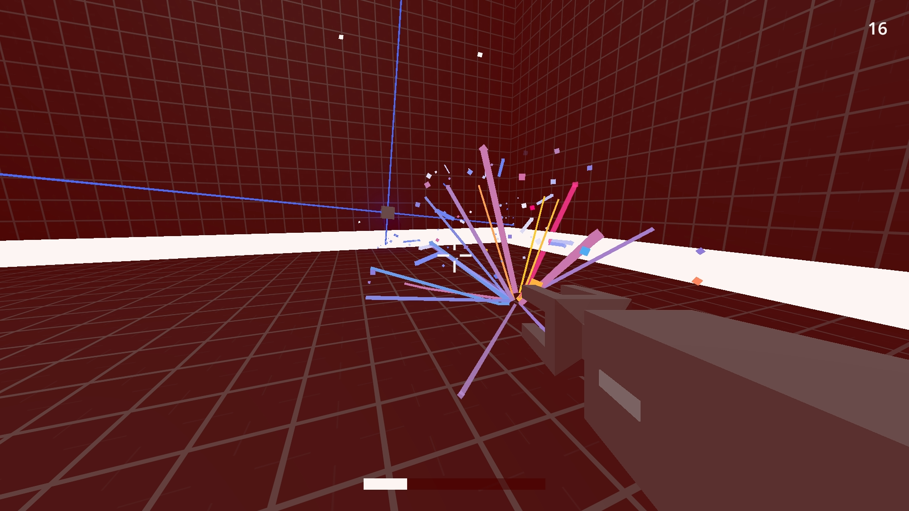
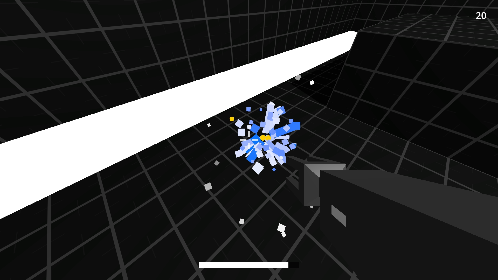

# Withstand

A game made in 48 hours for [Ludum Dare](http://ludumdare.com/compo/ludum-dare-37/?action=preview&uid=10029). Cloud source: [withstandleaderboard](https://github.com/paidgeek/withstandleaderboard).

Withstand a drone uprising. Use your laser gun to kill everything you see.

## Note
- Pick up "pixels" to gain points
- Pick up health packs to heal yourself
- A shield makes you temporary invincible
- Optionally, post your score to a global leaderboard for bragging purposes

## Play
- [Windows](https://github.com/paidgeek/Withstand/blob/master/Compo/Windows/Withstand.zip?raw=true)
- [OS/X](https://github.com/paidgeek/Withstand/blob/master/Compo/Mac/Withstand.zip?raw=true)
- [Linux](https://github.com/paidgeek/Withstand/blob/master/Compo/Linux/Withstand.zip?raw=true)
- [WebGL](https://paidgeek.itch.io/withstand) on itch.io, audio is a bit broken

